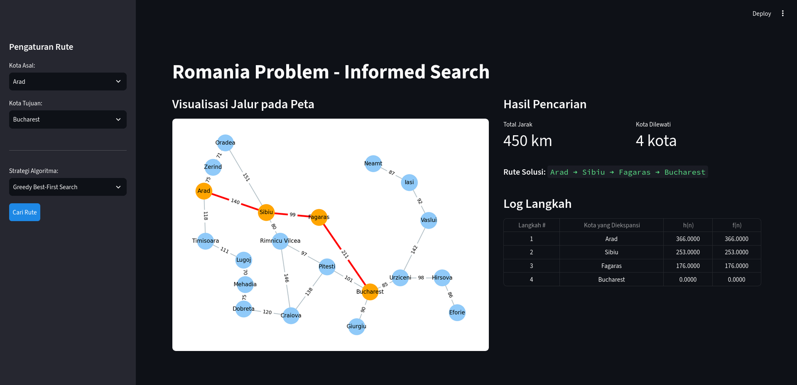
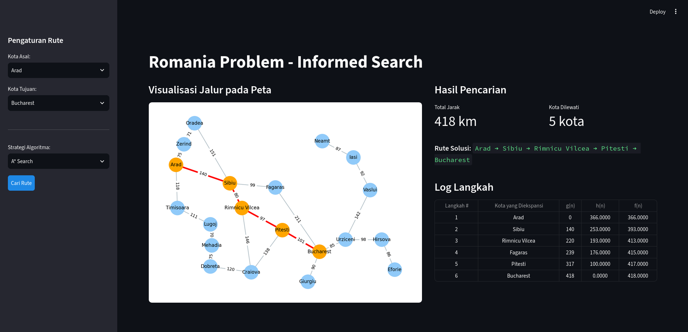

# Romania Problem - Informed Search

---

| | |
| :--- | :--- |
| **Nama** | Pandutama Putra Difira |
| **NRP** | 5025251070 |
| **Kelas** | KKA (A) |

## Deskripsi

Aplikasi web berbasis Python untuk memecahkan masalah Romania menggunakan algoritma A* dan Greedy BFS (Informed Search). User dapat menginput titik awal dan juga titik akhir, beserta algoritma pencarian yang ingin digunakan.

---

## Struktur Berkas

```text
├── app.py              # Program utama antarmuka Streamlit
├── algorithms.py       # Implementasi algoritma Greedy BFS dan A* Search
├── romania_data.py     # Data peta Romania, koordinat kota, dan nilai heuristik
├── requirements.txt    # Daftar dependensi library Python
├── assets/             # Gambar preview aplikasi
└── README.md           # Dokumentasi tugas
```

---

## Cara Menjalankan Program

1. **Install dependensi:**
   ```bash
   pip install -r requirements.txt
   ```

2. **Jalankan program:**
   ```bash
   streamlit run app.py
   ```

3. **Akses antarmuka web:**
   Buka peramban (browser) pada URL:
   ```
   http://localhost:8501
   ```

---

## Preview
Algoritma A*


Algoritma Greedy BFS



